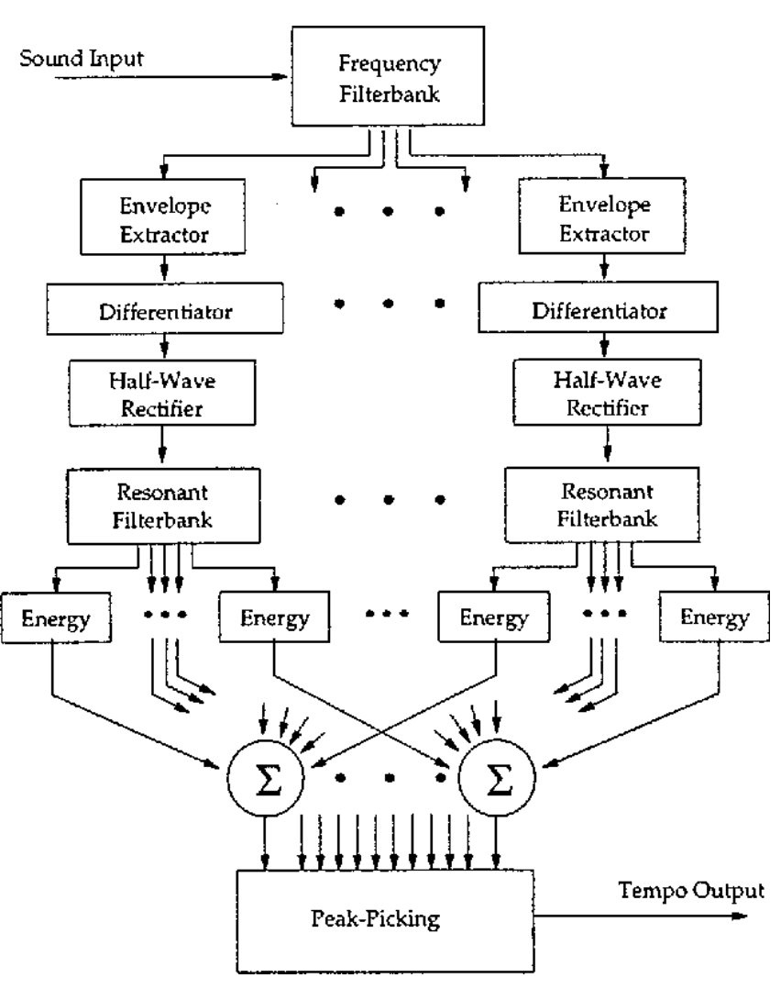

# Audio-Beat-Tracking

I adapted a beat detection algorithm from the paper ["Tempo and beat analysis of acoustic musical signals"(Scheirer, 1998)](http://www-labs.iro.umontreal.ca/~pift6080/H09/documents/papers/scheirer_jasa.pdf).
This algorithm processes an audio input and outputs the frequency(tempo) and phase(duration of beat) of the audio.

#### BLOCK DIAGRAM

#### 1. Filterbank: 
This filterbank has 6 bands each covering one-octave range. The lowest band is a 200Hz lowpass filter, and the highest band is  
a highpass filter with a cut-off off 3200Hz. The other 4 bands are band pass. Each filter was made with a 6th order, elliptic filter with a 3 dB passband ripple and a 40dB stopband ripple.

#### 2. Envelope Extraction 
The outputs from the filterbank was rectified and convolved with a 0.2s half-Hanning window

#### 3. Differentiator & Half-Wave Rectifier
"After calculating the envelope, the first-order difference function is calculated and half-wave rectified. This rectified
difference signal will be examined for periodic modulation." 

#### 4. Comb Filter & Peak-Picking

For each envelope channel of the frequency filterbank, a filterbank of comb filters is implemented, in which the delays
vary by channel and cover the range of possible pulse frequencies to track. The output of these resonator filterbanks is
summed across frequency subbands. By examining the energy output from each resonance channel of the summed resonator filterbanks, the strongest periodic component of the signal may be determined. The frequency of the resonator
with the maximum energy output is selected as the tempo of the signal.

#### Plotting Results

- [Filter Bank](FilterBank.png)
- [Envelope](HanWindow.png)
- [Rectified Envelope Difference](DiffRect.png)

